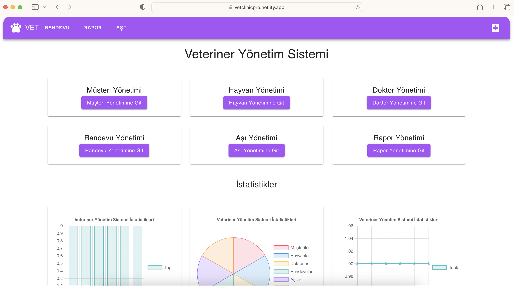

<p align="center"> 
  
</p>

<h1 align="center">Veteriner Yönetim Sistemi</h1> 

</br>

<p align="center"> 
  
</p>

<!-- TABLE OF CONTENTS -->
<h2 id="table-of-contents">:book: İçerik</h2>

<details open="open">
  <summary>İçerik</summary>
  <ol>
    <li><a href="#hakkinda">➤ Proje Hakkında</a></li>
    <li><a href="#teknolojiler">➤ Kullanılan Teknolojiler</a></li>
    <li><a href="#gereklilikler">➤ Gereklilikler</a></li>
    <li>
      <a href="#kurulum">➤ Kurulum</a>
     <ul>
        <li><a href="#backend-kurulum">Backend Projesi Kurulumu</a></li>
        <li><a href="#npm-kurulum">Frontend Npm Kurulumu</a></li>
      </ul>
    </li>
    <li><a href="#klasor-yapisi">➤ Klasör Yapısı</a></li>
    <li><a href="#endpoint">➤ Endpointler</a></li>
    <li><a href="#front">➤ Frontend Ekran Görüntüsü</a></li>
    <li><a href="#gelistirme">➤ Geliştirme Hakkında</a></li>
    <li><a href="#iletisim">➤ İletişim ve Bilgiler</a></li>
  </ol>
</details>


<!-- ABOUT THE PROJECT -->
<h2 id="hakkinda">:pencil: Proje Konusu</h2>

<p align="justify"> 
<b>Proje Konusu:</b>
Veterinerler için rapor ve aşı yönetim sisteminin React ve Spring Boot kullanılarak geliştirilmesi. Kullanıcılar rapor oluşturabilir, raporlara aşı bilgisi ekleyebilir ve raporları PDF formatında indirebilirler.

Proje canlıya alınmıştır ve aşağıdaki linkten ulaşabilirsiniz:

<a href="https://vetclinicpro.netlify.app/">Site Linki</a> <br>
</p>


<!-- TECHNOLOGIES -->
<h2 id="teknolojiler">:fork_and_knife: Kullanılan Teknolojiler</h2>

[](https://www.java.com/)
[](https://reactjs.org/)

Projede kullanılan diğer teknolojiler:


* Material-UI
* Axios
* React-PDF
* Vite


<!-- PREREQUISITES -->
<h2 id="gereklilikler">:fork_and_knife: Gereklilikler</h2>

Projede kullanılan teknolojiler ve araçlar:

* [Java 17](https://www.oracle.com/java/technologies/downloads/#java17)
* [Maven](https://maven.apache.org/download.cgi)
* [Node.js ve Npm](https://nodejs.org/en/download/)
* [Docker](https://www.docker.com/) (Opsiyonel)


<!-- SETUP -->
<h2 id="kurulum"> :hammer: Kurulum</h2>

Projeyi lokal sunucunuza kurmak için aşağıdaki adımları takip edebilirsiniz.


<h3 id="backend-kurulum">:hammer: Backend Projesi Kurulumu</h3>

<p align="justify">
Backend projesi için gerekli kurulum adımları:

Backend projesinin github reposu: [Vet-App](https://github.com/esrasen/Vet-App)


1. Öncelikle projeyi GitHub deposundan klonlayın.

    ```sh
    git clone https://github.com/esrasen/Vet-App.git
    ```

2. src/main/resources/application.properties dosyasında veritabanı konfigürasyonunu yapın:

    ```properties
    spring.datasource.url=jdbc:postgresql://localhost:5432/vetapp
    spring.datasource.username=root
    spring.datasource.password=password
    spring.jpa.hibernate.ddl-auto=update
    ```

3. Maven bağımlılıklarını yükleyin ve projeyi çalıştırın:

    ```sh
    cd Vet-App
    mvn clean install
    mvn spring-boot:run
    ```


4. Backend projesi başarılı bir şekilde çalıştıktan sonra, frontend projesini kurulum adımlarına geçebilirsiniz.


</p>


<h3>:hammer: Docker İle Backend Projesi Kurulumu</h3>


1. Terminalde proje kök dizininde aşağıdaki komutu çalıştırarak tüm servisi başlatın:

     ```sh
    docker-compose up
    ```
   Projeyi çalıştırdıktan sonra aşağıdaki URL'ler üzerinden erişebilirsiniz:
   - Backend: `http://localhost:7071`
   - Frontend: `http://localhost:5173`
   


<h3 id="npm-kurulum">:hammer: Frontend Npm Kurulumu</h3>

<p align="justify">
1. Frontend bağımlılıklarını yükleyin ve projeyi çalıştırın:

    ```sh
    cd src/frontend
    npm install
    npm start
    ```

2. Backend projesinin URL'ini src/config.js dosyasında güncelleyin:

    ```js
    const API_BASE_URL = "http://localhost:8080/api/v1";
    ```

3. Projeyi çalıştırdıktan sonra aşağıdaki URL'ler üzerinden erişebilirsiniz:
    - Backend: `http://localhost:8080`
    - Frontend: `http://localhost:5432`
</p>


<!-- FOLDER STRUCTURE -->
<h2 id="klasor-yapisi"> :cactus: Klasör Yapısı</h2>

```plaintext
VeterinaryApp/
│
├── public/
│
│
├── src/
│   ├── assets/
│   │   ├── images/
│   │   ├── fonts/
│   ├── pages/
│   │   ├── Customer.jsx
│   │   ├── Doctor.jsx
│   │   ├── Animal.jsx
│   │   ├── Appointment.jsx
│   │   ├── Vaccination.jsx
│   │   ├── Report.jsx
│   │   ├── Home.jsx
│   ├── components/
│   │   ├── Navbar.jsx
│   ├── App.jsx
│   ├── App.css
│   ├── main.jsx
│   ├── config.js
│
└── README.md

Klasör yapısının kısa açıklaması:

public/: Statik dosyalar ve genel kaynaklar.
src/: Uygulama kaynak kodları.
assets/: Projeye ait resimler.
components/: React bileşenleri.
pages/: Sayfa bileşenleri.
App.jsx: Uygulama bileşeni.
main.jsx: Uygulama giriş noktası.
config.js: Konfigürasyon dosyası.
```


<!-- ENDPOINTS -->
<h2 id="endpoint"> :floppy_disk: Endpointler</h2>

Frontend projesinde kullanılan backend API endpointleri:

| Endpoint                                  | HTTP Metodu | Açıklama                                       |
|-------------------------------------------|-------------|------------------------------------------------|
| `/api/v1/customers/{id}`                  | GET         | Belirtilen ID'ye sahip hayvan sahibini getirir |
| `/api/v1/customers/{id}`                  | PUT         | Belirtilen ID'ye sahip hayvan sahibini günceller|
| `/api/v1/customers/{id}`                  | DELETE      | Belirtilen ID'ye sahip hayvan sahibini siler   |
| `/api/v1/customers`                       | GET         | Tüm hayvan sahiplerini getirir                 |
| `/api/v1/customers`                       | POST        | Hayvan sahibi ekler                            |
| `/api/v1/customers/searchByName`          | GET         | İsme göre hayvan sahiplerini getirir           |
| `/api/v1/animals/{id}`                    | GET         | Belirtilen ID'ye sahip hayvanı getirir         |
| `/api/v1/animals/{id}`                    | PUT         | Belirtilen ID'ye sahip hayvanı günceller       |
| `/api/v1/animals/{id}`                    | DELETE      | Belirtilen ID'ye sahip hayvanı siler           |
| `/api/v1/animals`                         | GET         | Tüm hayvanları getirir                         |
| `/api/v1/animals`                         | POST        | Hayvan ekler                                   |
| `/api/v1/animals/searchByName`            | GET         | İsme göre hayvanları filtreler                 |
| `/api/v1/animals/searchByCustomer`        | GET         | Hayvan sahiplerine göre hayvanları filtreler   |
| `/api/v1/vaccines/{id}`                   | GET         | Belirtilen ID'ye sahip aşıyı getirir           |
| `/api/v1/vaccines/{id}`                   | PUT         | Belirtilen ID'ye sahip aşıyı günceller         |
| `/api/v1/vaccines/{id}`                   | DELETE      | Belirtilen ID'ye sahip aşıyı siler             |
| `/api/v1/vaccines`                        | GET         | Tüm aşıları getirir                            |
| `/api/v1/vaccines`                        | POST        | Aşı ekler                                      |
| `/api/v1/vaccines/searchByVaccinationRange`| GET        | Girilen tarih aralığına göre aşı kayıtlarını getirir |
| `/api/v1/vaccines/searchByAnimal`         | GET         | Belirli bir hayvana ait tüm aşı kayıtlarını getirir |
| `/api/v1/doctors/{id}`                    | GET         | Belirtilen ID'ye sahip doktoru getirir         |
| `/api/v1/doctors/{id}`                    | PUT         | Belirtilen ID'ye sahip doktoru günceller       |
| `/api/v1/doctors/{id}`                    | DELETE      | Belirtilen ID'ye sahip doktoru siler           |
| `/api/v1/doctors`                         | GET         | Tüm doktorları getirir                         |
| `/api/v1/doctors`                         | POST        | Doktor ekler                                   |
| `/api/v1/available_dates/{id}`            | GET         | Belirtilen ID'ye sahip müsait günü getirir     |
| `/api/v1/available_dates/{id}`            | PUT         | Belirtilen ID'ye sahip müsait günü günceller   |
| `/api/v1/available_dates/{id}`            | DELETE      | Belirtilen ID'ye sahip müsait günü siler       |
| `/api/v1/available_dates`                 | GET         | Tüm müsait günleri getirir                     |
| `/api/v1/available_dates`                 | POST        | Müsait gün ekler                               |
| `/api/v1/appointments/{id}`               | GET         | Belirtilen ID'ye sahip randevuyu getirir       |
| `/api/v1/appointments/{id}`               | PUT         | Belirtilen ID'ye sahip randevuyu günceller     |
| `/api/v1/appointments/{id}`               | DELETE      | Belirtilen ID'ye sahip randevuyu siler         |
| `/api/v1/appointments`                    | GET         | Tüm randevuları getirir                        |
| `/api/v1/appointments`                    | POST        | Randevu ekler                                  |
| `/api/v1/appointments/searchByDoctorAndDateRange` | GET | Kullanıcı tarafından girilen tarih aralığına ve doktora göre randevuları filtreler |
| `/api/v1/appointments/searchByAnimalAndDateRange` | GET | Kullanıcı tarafından girilen tarih aralığına ve hayvana göre randevuları filtreler |


<!-- CONTACT -->
<h2 id="iletisim"> :scroll: İletişim ve Bilgiler</h2>

<p align="justify"> 

✤ <a href="https://linkedin.com/in/esra-sen">LinkedIn</a> <br>
✤ <a href="https://github.com/esrasen">GitHub</a> <br>
</p>


